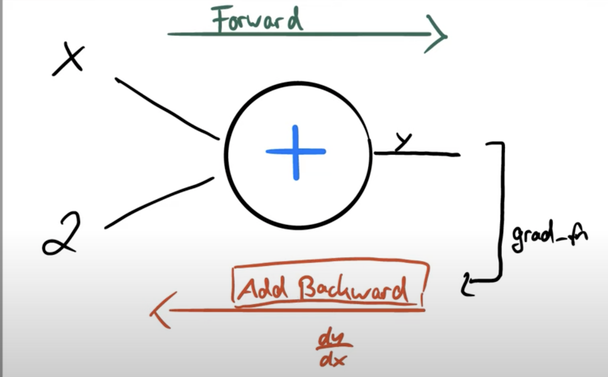

# PLDAC - Embedded-Machine-Learning
The objective of this project is to explore the possibilities of NVIDIA's Jetson Nano and coral dev Board mini for real-time video processing. The idea is to develop a processing pipeline for the autonomous driving of a small car robot (such as the GoPiGo) in order to compare the performance of different solutions (in terms of calculation time).

The main steps of the project are as follows:
- Getting to know the Jetson and coral platforms, and interfacing either hardware or software between the robot and the board;
- Building a video processing pipeline using existing solutions: video flow acquisition and processing, segmentation algorithms, deep classification models
- Developing a manual controller initially using the perceived information
- If time allows, exploring Reinforcement Learning techniques for accomplishing a specific task.

## Run on my terminal
```sh
python3 pytorch_tuto.py
```

## Run on my VS
```sh
python3.9 pytorch_tuto.py 
```

## Pytorch
### Tensor
On pytorch everything is a Tensor which can have multiple dimensions (1d, 2d, 3d)

### Create random tensor
```py
# create tensor of size 2 x 2 with random values
x = torch.rand(2, 2)
y = torch.rand(2, 2)
```

### Basic operations
```py
# z = x + y
z = torch.add(x, y)
# z = x - y
z = torch.sub(x, y)
# z = x * y
z = torch.mul(x, y)
# z = x / y
z = torch.div(x, y)
```

```sh
# modify y by addding x
y.add_(x)
```

### Make 1D torch array
```sh
x = torch.rand(4, 4)
# put all elements of x into y of dimension 1
y = x.view(16)
```

### Change dimension
```sh
x = torch.rand(4, 4)
# put all elements of x into y 
# of dimension 8
# first parameter -1 says that we do not want 1d
y = x.view(-1, 8)
```

### Numpy arrays
```py
a = torch.ones(5)
# b become a numpy array of a
b = a.numpy()
# a and b point to the same memory location
# if we modify a or b, changes apply to both of them
```

```py
a = torch.ones(5)
# b become a numpy array of a
# dtype : data type
b = torch.from_numpy(a, dtype)
```

### Require using gradient
```py
# 5 : size of the tensor
x = torch.ones(5, requires_grad=True)
```

### Gradient
```py
x = torch.randn(3, requires_grad=True)
print(x)

# create computational graph
y = x + 2
```




```py
x = torch.randn(3, requires_grad=True)
print(x)
y = x + 2
print(y)

z = y * y * 2
z = z.mean()
print(z)
z.backward() # dz/dx
print(x.grad) # gradients are stored here
```
Output : We calculate the gradient using an add backward function, because we are doing back propagation
```sh
>> tensor([ 0.9348, -0.1318,  0.1021],requires_grad=True)
>> tensor([2.9348, 1.8682, 2.1021], grad_fn=<AddBackward0>)
>> tensor(12.8016, grad_fn=<MeanBackward0>)
>> tensor([3.8261, 3.0445, 3.1983])
```

